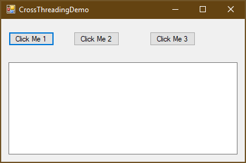
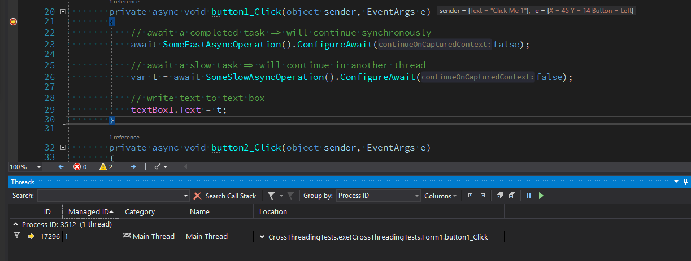

# Async/await in Desktop Applications

This repository contains a sample WinForms application to demonstrate
async/await "challenges" in UI programming.



The form contains three buttons which are intended to download the
the content from http://microsoft.com asynchronously and show it
in a TextBox.

## Cross-Thread issue :(

```csharp
private async void button1_Click(object sender, EventArgs e)
{
    // await a completed task => will continue synchronously
    await SomeFastAsyncOperation().ConfigureAwait(false);

    // await a slow task => will continue in another thread
    var t = await SomeSlowAsyncOperation().ConfigureAwait(false);

    // write text to text box
    textBox1.Text = t;
}
```

When clicking the first button, an `InvalidOperationException` will
be thrown with the message

> Cross-thread operation not valid: Control 'textBox1' accessed from a
> thread other than the thread it was created on.

That's because in Win32 UIs you must access controls from the same thread
that created them. Because the after awaiting `SomeSlowAsyncOperation`
the method continues not in the main thread but a nackground thread,
accessing `textBox1` is forbidden.

When you debug `button1_Click`, pay attention to the *Threads* tool window.



1. Entering the method, you'll be on thread #1, the main thread.
2. After calling `SomeFastAsyncOperation`, the code continues on thread #1.
   That's because the method returns an already completed task, so the code
   can continue synchronously.
3. In contrast, `SomeSlowAsyncOperation` returns a not-completed task, 
   therefore the succeeding code will continue not another one. (The UI thread
   will be released here and continue pumping the Win32 message queue)
4. The property `textBox1.Text` will be set in said background thread and
   fail, because Win32 controls mist be accessed from the same thread that
   created them.


## Blocking :(

```csharp
private async void button2_Click(object sender, EventArgs e)
{
    // await a completed task => will continue synchronously
    await SomeFastAsyncOperation().ConfigureAwait(false);

    // await a slow task => will continue in another thread
    var t = SomeSlowAsyncOperation().ConfigureAwait(false).GetAwaiter().GetResult();

    // write text to text box
    textBox1.Text = t;
}
```

Clicking the second button will freeze the application. The
`GetAwaiter().GetResult()` invocation will try to re-enter the
the main thread, which is waiting for the task, so we'll run into a dead-lock.

## Run smoothly :)

```csharp
private async void button3_Click(object sender, EventArgs e)
{
    // force switch to threadpool thread
    await TaskScheduler.Default;

    // await a completed task => will continue synchronously
    await SomeFastAsyncOperation().ConfigureAwait(false);

    // await a slow task => will continue in another thread
    var t = await SomeSlowAsyncOperation().ConfigureAwait(false);

    // switch to main thread
    await _joinableTaskFactory.SwitchToMainThreadAsync();

    // write text to text box
    textBox1.Text = t;
}
```

Using the `JoinableTaskFactory` from [_Microsoft.VisualStudio.Threading_](https://github.com/Microsoft/vs-threading)
(NuGet package [here](https://nuget.org/packages/Microsoft.VisualStudio.Threading)),
we are able to "switch" back to the UI thread.

As the namespace implies, _Microsoft.VisualStudio.Threading_ originates from
the Visual Studio team. I stumbled over this library while reading the documentation
for Visual Studio extensibility. Visual Studio is quite a complex application, and
there are myriads of extensions available. To improve the start-up time, Microsoft
strongly recommends to make use of asynchronous programming (see
[_How to: Manage multiple threads in managed code_](https://docs.microsoft.com/en-us/visualstudio/extensibility/managing-multiple-threads-in-managed-code?view=vs-2017)
and [_How to: Use AsyncPackage to load VSPackages in the background_](https://docs.microsoft.com/en-us/visualstudio/extensibility/how-to-use-asyncpackage-to-load-vspackages-in-the-background?view=vs-2017))

I won't go into details of how async/await works. Basically, the compiler generates
a state machine, which Dixin explains pretty good in his blog serie
[_Understanding C# async / await (1) Compilation_](https://weblogs.asp.net/dixin/understanding-c-sharp-async-await-1-compilation) 
([Part 2](https://weblogs.asp.net/dixin/understanding-c-sharp-async-await-2-awaitable-awaiter-pattern), 
[Part 3](https://weblogs.asp.net/dixin/understanding-c-sharp-async-await-3-runtime-context)).

In our case, two calls are interesting:

1. `await TaskScheduler.Default;` will continue the succeeding code in a threadpool thread<br>
   <small>(actually, the library provides an extension method `GetAwaiter(this TaskScheduler this)`.
   This works because the compiler uses a naming convention instead of requiring an interface implemenntation)</small>
2. `await _joinableTaskFactory.SwitchToMainThreadAsync();` will continue the succeeding code in the
   main thread <br><small>(actually, in the thread with instantiated `_joinableTaskFactory`).</small>

As you could see, _Microsoft.VisualStudio.Threading_ makes asynchronous programming
in desktop applications, both WinForms and WPF, much simpler.

BTW, I've learned a lot reading the [code of that library](https://github.com/Microsoft/vs-threading). It provides
much more async helpers like `AsyncEventHandlers`.

Here are some more links if you want to learn more about async programming:

* [_The 3 VS Threading Rules_](https://www.slideshare.net/aarnott/the-3-vs-threading-rules) by Andrew Arnott

* [_Don't Block on Async Code_](https://blog.stephencleary.com/2012/07/dont-block-on-async-code.html) by Stephen Cleary

* [_Concurrency in C# Cookbook: Asynchronous, Parallel, and Multithreaded Programming_](https://lesen.amazon.de/kp/embed?asin=B00KCY2CB4&preview=newtab&linkCode=kpe&ref_=cm_sw_r_kb_dp_WWQtCbZETE973) by Stephen Cleary

